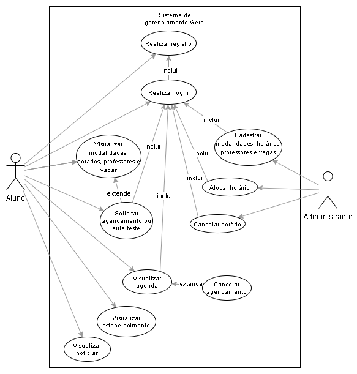

<h1>🧘‍♀️ Projeto - SaúdeA+ 🧘‍♂️</h1>

> <h2>💬 Sobre o Projeto</h2>

  O studio de Pilates (saúde a+) necessita sistema de gerenciamento das atividades/modalidades do estúdio e o agendamento de aulas teste e reposições. 
  Esse sistema poderá ser acessado pelos administradores do studio, pelos alunos matriculados ou visitantes que desejem agendar uma aula.

> <h2>📝 Elicitação de Requisitos</h2>

  Na fase de levantamento de requisitos, nós dedicamos a entender o objetivo geral do problema para a realização do sistema do studio, 
  focando principalmente nas funções gerais do projeto e na realização de agendamento de aulas, atividades e modalidades, bem como agendamento 
  de aulas teste e reposições, além disso, para que um aluno possa solicitar a aula teste ou reposição, o mesmo necessita entrar em contato com 
  a equipe responsável pelo agendamento no studio.

  Desta forma, o studio de Pilates (saúde a+) necessita sistema de gerenciamento das atividades/modalidades do estúdio e o agendamento de aulas 
  teste e reposições. Assim, buscamos inicialmente realizar o estudo dos requisitos funcionais e não funcionais para integrar no sistema.

> <h2>👥 Atores do Sistema</h2>

<table>
  <tr>
    <td align="center">
      
Atores

    </td>
    <td align="center">
      
Descrição

    </td>
  </tr>
  <tr>
    <td align="center">
      
Administrador

    </td>
    <td>
      

        O administrador do sistema pode cadastrar modalidades, horários, professores e vagas.
        O administrador também pode alocar horários para usuários e cancelar algum horário agendado.
        O administrador pode gerenciar os usuários.
      

    </td>
  </tr>
  <tr>
    <td align="center">
      
Usuário comum

    </td>
    <td>
      

        Pode visualizar as modalidades, horários, professores e vagas, pode solicitar o agendamento 
        de uma aula experimental, ver a localização do estabelecimento e as principais notícias.
      

    </td>
  </tr>
</table>

> <h2> :gear: Requisitos Funcionais</h2>
<table>
    <tr>
        <td align="center">
            
Identificado

        </td>
        <td align="center">
            
Descrição

        </td>
    </tr>
    <tr>
        <td align="center">
            
RF01

        </td>
        <td>
            
O sistema deve permitir que os usuários realizem seu registro no sistema com suas informações pessoais.

        </td>
    </tr>
    <tr>
        <td align="center">
            
RF02

        </td>
        <td>
            
O sistema deve permitir que os usuários loguem no sistema com suas informações pessoais.

        </td>
    </tr>
    <tr>
        <td align="center">
            
RF03

        </td>
        <td>
            
O sistema deve permitir que o administrador possa cadastrar modalidades, horários, professores e vagas.

        </td>
    </tr>
    <tr>
        <td align="center">
            
RF04

        </td>
        <td>
            
O sistema deve permitir que o administrador possa alocar horários e cancelar algum horário agendado.

        </td>
    </tr>
    <tr>
        <td align="center">
            
RF05

        </td>
        <td>
            
O sistema deve permitir que os usuários possam visualizar as modalidades, horários, professores e vagas.

        </td>
    </tr>
    <tr>
        <td align="center">
            
RF06

        </td>
        <td>
            
O sistema deve permitir que os alunos possam solicitar o agendamento de uma aula experimental.

        </td>
    </tr>
    <tr>
        <td align="center">
            
RF07

        </td>
        <td>
            
O sistema deve permitir que os usuários logados possam visualizar a sua agenda.

        </td>
    </tr>
    <tr>
        <td align="center">
            
RF08

        </td>
        <td>
            
O sistema deve permitir que os alunos possam agendar uma reposição.

        </td>
    </tr>
    <tr>
        <td align="center">
            
RF09

        </td>
        <td>
            
O sistema deve permitir que os usuários possam ver a localização do estabelecimento.

        </td>
    </tr>
    <tr>
        <td align="center">
            
RF10

        </td>
        <td>
            
O sistema deve permitir que os usuários possam ver as principais notícias.

        </td>
    </tr>
</table>

> <h2>💼 Regras de Négocio</h2>

<table>
  <tr>
    <td colspan="2" align="center">
      
Usuários logados (RN01)

    </td>
  </tr>
  <tr>
    <td align="center">
      
Descrição

    </td>
    <td>
      

        O usuário logado pode visualizar a sua agenda, que corresponde às modalidades em que está cadastrado e seus horários. 
        Pode solicitar o agendamento de uma aula experimental ou de uma reposição, desde que tenha vaga no horário e pode cancelar uma aula.
      

    </td>
  </tr>
  <tr>
    <td colspan="2" align="center">
      
Reposição de aulas (RN02)

    </td>
  </tr>
  <tr>
    <td align="center">
      
Descrição

    </td>
    <td>
      

        Aulas canceladas com, pelo menos, 1 hora de antecedência geram o direito de uma reposição. 
        O usuário também pode visualizar as reposições a que tem direito. Uma reposição não pode ser reagendada.
      

    </td>
  </tr>
  <tr>
    <td colspan="2" align="center">
      
Cadastro de Usuários (RN03)

    </td>
  </tr>
  <tr>
    <td align="center">
      
Descrição

    </td>
    <td>
      

        O cadastro de um usuário exige nome, endereço, cpf e data de nascimento e adicionar uma foto (opcional). 
        O usuário cadastrado também pode alterar seu perfil.
      

    </td>
  </tr>
</table>

> <h2> :world_map: Modelagem da Visão Geral </h2>

> <h2>🕵️ Telas identificadas para o sistema</h2>

<h3>Tela de visão geral</h3>

- Visualizar as modalidades ofertadas;
- Visualizar horários de aula;
- Visualizar os professores/instrutores (fisioterapeutas);
- Visualizar a localização do estabelecimento;
- Visualizar as principais notícias;
- Solicitar agendamento de aula experimental (Ir para formulário de cadastro).

<h3>Tela de login</h3>

- Usuário;
- Senha;
- Esqueci a senha;
- Opção para se cadastrar (Ir para formulário de cadastro).

<h3>Tela de formulário de cadastro</h3>

- Nome;
- Endereço;
- CPF;
- Data de nascimento;
- Foto de perfil (opcional).

<h3>Tela de visão de usuário comum</h3>

- Funcionalidades em comum com a tela de visão geral;
- Opção para alterar o perfil (Tela de alteração de perfil);
- Opção de visualização da agenda, correspondente às modalidades que ele está cadastrado e os seus horários.
- Opção para visualizar e/ou realizar de uma reposição, desde que tenha um horário vago;
- Opção para cancelar uma aula;
- Fazer logout do sistema.

<h3>Tela de visão do administrador</h3>

- Funcionalidades em comum com a tela de visão geral;
- Opção para gerenciar os usuários (Tela de usuários cadastrados);
- Opção de cadastro de modalidades (Tela para o cadastro de modalidades);
- Opção para cadastro de horários (Tela para o cadastro de horários);
- Opção para cadastro de professores (Tela para o cadastro de professores);
- Fazer logout do sistema.

<h3>Tela de grade de horários para agendamentos</h3>

<h3>Tela de usuários cadastrados</h3>

<h3>Tela de cadastro de professores</h3>

<h3>Tela de alteração de perfil</h3>

- Alterar nome
- Alterar foto
- Alterar usuário
- Alterar senha

<h3>Tela para o cadastro de horários</h3>

- Opção para alocar horário a um usuário;
- Opção para cancelar algum horário agendado;

> <h3> 👨‍💻 Contribuidores </h3>

🚀 Equipe de desenvolvimento - 🌵 Os Shaolins do Sertão

<table align="center">
  <tr align="center">
    <td>
      <a href="https://github.com/daviteixeira-btm">
        
        
Davi  Teixeira

      </a>
      
🦇

    </td>
    <td>
      <a href="https://github.com/fco-alves">
        
        
Francisco  Alves

      </a>
      
🍕

    </td>
    <td>
      <a href="https://github.com/guilhermanosilva">
        
        
Guilhermano  Silva

      </a>
      
:octocat:

    </td>
    <td>
      <a href="https://github.com/LaelKayo">
        
        
Lael  Kayo

      </a>
      
👨‍💻

    </td>
    <td>
      <a href="https://github.com/aSTRonuun">
        
        
Vitor  Alves

      </a>
      
🌌

    </td>
    <td>
      <a href="https://github.com/wesleypavanello">
        
        
Wesley  Pavanello

      </a>
      
🧠

    </td>
  </tr>
</table>
